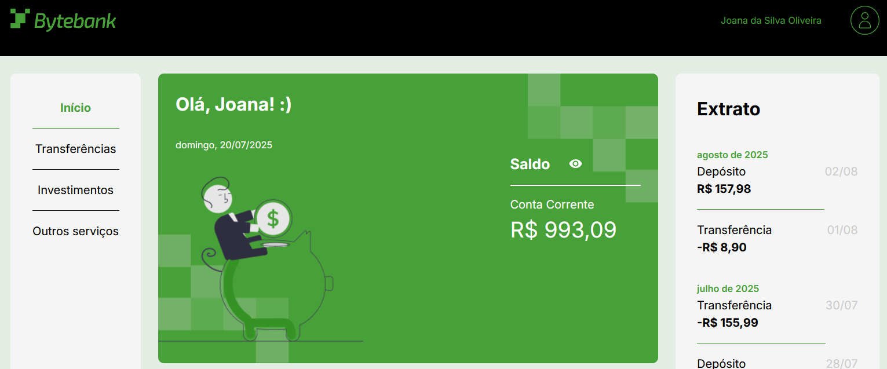
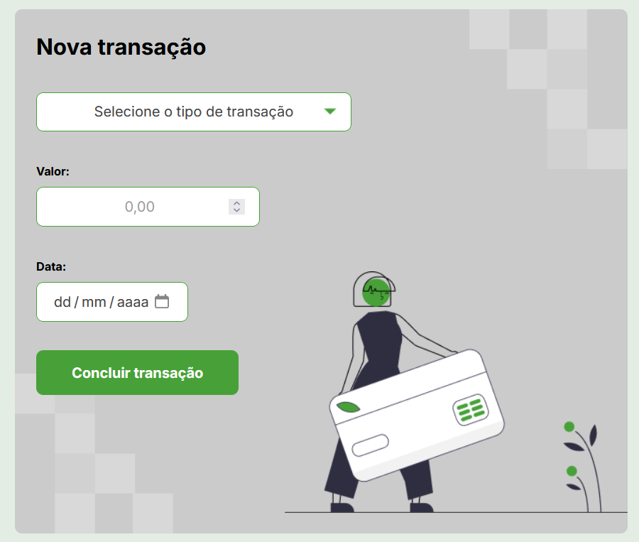
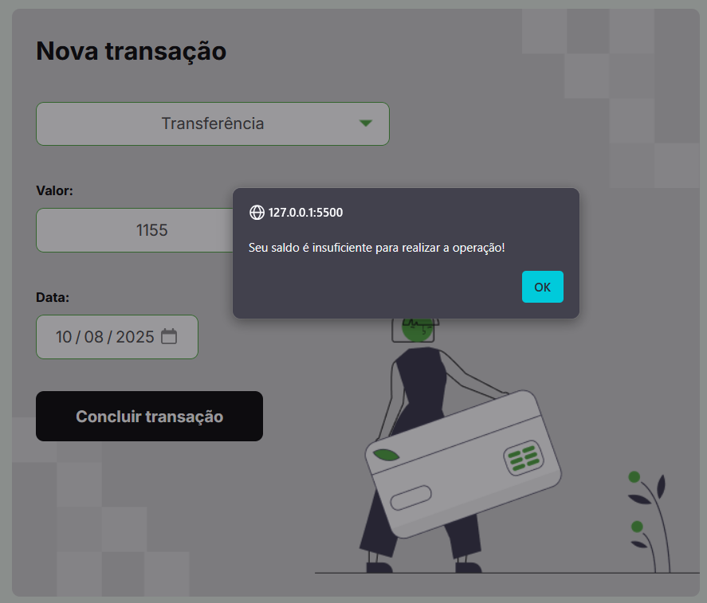

## 🏦 ByteBank – Orientação a Objetos

O **ByteBank** é um sistema bancário fictício desenvolvido com **TypeScript** e **paradigma de orientação a objetos**, onde o usuário pode realizar depósitos, transferências e pagamento de boletos. Neste projeto, trechos de lógica funcional foram transformados em **classes, métodos e decorators**, garantindo estrutura mais segura e organizada.

 

## 🚀 Sobre o Projeto

Este projeto foi desenvolvido durante o curso da Alura:

* "TypeScript: aplicando orientação a objetos no Front-end"

O foco foi refatorar código de paradigma funcional para **orientação a objetos**, explorando **classes, herança, modificadores de acesso e decorators para validações**, melhorando a manutenibilidade e segurança do ByteBank.

## 📚 Objetivos do Curso

* Compreender as características do **paradigma funcional e de orientação a objetos com Typescript**;
* Aprender a construir **classes e métodos**;
* Saber como utilizar **modificadores de acesso** para melhorar a segurança do projeto;
* Conhecer o conceito de **herança** para construir novas classes sem repetir código;
* Realizar a implementação de validações a partir de **decorators**.

## 🛠️ Tecnologias Utilizadas

## 🖼️ Visualização do Projeto

Uma prévia das principais funcionalidades do **ByteBank**:

**🖥️ Tela Inicial**

Dashboard com saldo da conta e histórico de transações.

**💰 Depósito e Transferência**

Formulário para realizar depósitos em conta e transferir valores.

**⚠️ Erro de Saldo Insuficiente**

Mensagem de alerta exibida quando o usuário tenta operar sem saldo suficiente.

